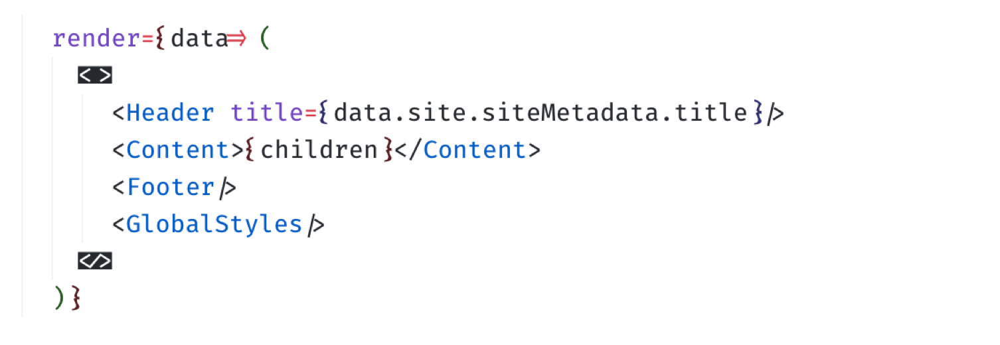
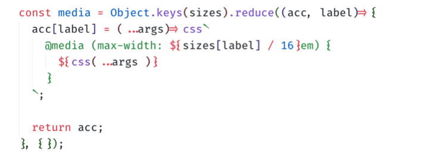
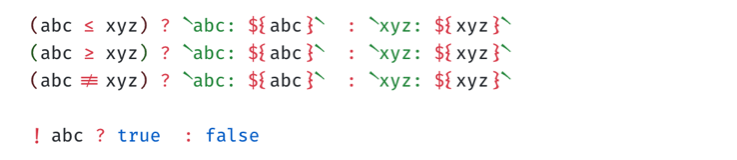

This is a modification of the best coding font out there: [Fira Code](https://github.com/tonsky/FiraCode). But I want font ligatures that are especially geared towards ES6 and ReactJS codes, thus this project.

#### Modified ligatures thus far:

- Curly braces
- Fat arrow 
- `React.Fragment`
- Closing tag (singular tag)

---

---

- Backticks
- Spread operator

---

---

- leq sign
- geq sign
- neq sign
- not sign

